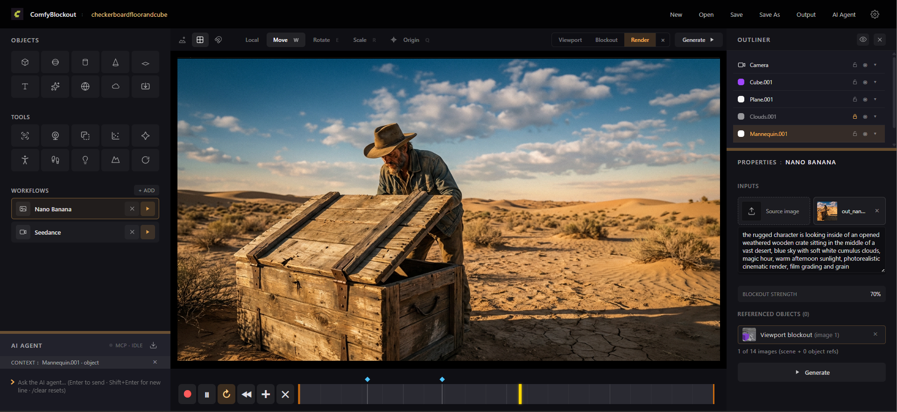
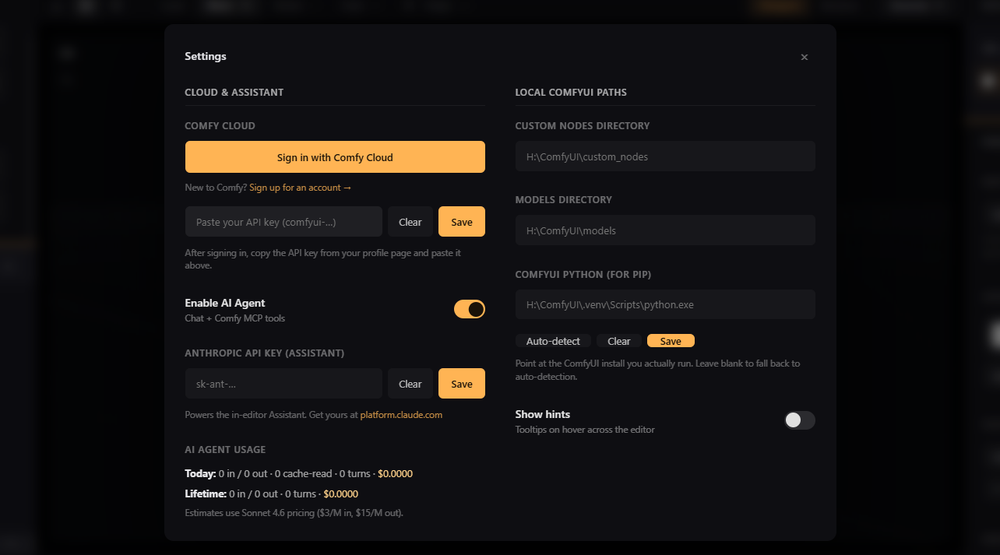
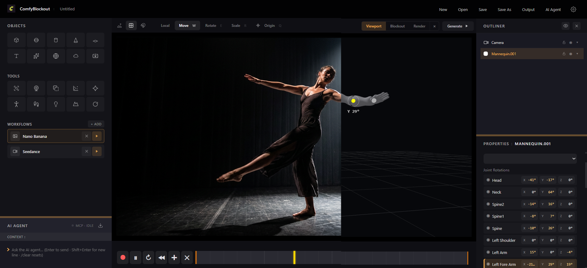

# ComfyBlockout

A **3D blockout editor** that turns your scene into a rendered image or video via **Comfy Cloud** or **local ComfyUI**. Block in objects, frame the shot, animate on a timeline, then generate — all from one app.

Built for people who want the creative frame of a 3D editor without the mesh-modeling depth of Blender. Drop primitives, splats, skyboxes, terrain, mannequins, lights. Aim the camera. Add keyframes. Hit Generate.



---

## Install

```
run.bat
```

First launch creates a `.venv`, installs deps (FastAPI + `comfy-cli` + ffmpeg shim + Pillow + OpenCV), then opens [http://127.0.0.1:8765](http://127.0.0.1:8765).

Windows only for now. Requires Python 3.10+ on PATH.

## Auth



**Comfy Cloud (required for cloud workflows):** open **Settings** (gear icon, top-right), hit **Sign in with Comfy Cloud** — the API keys page opens in a new tab at `platform.comfy.org/profile/api-keys`. Sign up first via the "New to Comfy?" link if you don't have an account. Copy the key, paste it into the input below the button, hit Save.

**Anthropic (optional, for the AI Agent):** in the same Settings modal, add your key from `platform.claude.com` and flip **Enable AI Agent** on. Without this, the AI Agent panel stays disabled and the editor works fine — you just drive it with the mouse instead of a chat.

**Local ComfyUI (optional):** if you also want to run local workflow JSONs, fill in the three paths in the right column (custom nodes / models / Python). **Auto-detect** tries to find a working install.

---

## Features

### Objects

Left panel · top grid. Click to spawn.

- **Primitives** — cube, sphere, cylinder, cone, plane, text.
- **Particles** — GPU shader particle system with agent-facing presets (snow, rain, sparks, fireflies).
- **Skybox** — inverted sphere backdrop; drop / generate a 360° equirectangular panorama onto it.
- **Clouds** — volumetric FX with Mask + Evolve controls, wind-driven mask, snapshot grid.
- **Import** — click the ↓ tile or drag `.glb / .gltf / .fbx / .obj / .ply / .splat / .spz / .ksplat` files onto the viewport.

### Tools

Left panel · middle grid. Each tool spawns / operates on the current scene.

- **Video Preprocessors** — run a video through Lotus depth, OpenPose, DepthCrafter, or Depth Pro. Result becomes an AR-rectangle overlay + a per-frame video output.
- **MediaPipe** — webcam pose / hand / face tracking. Record a sequence, take stills, or use the feed as a live viewport source.
- **Boolean** — union / subtract / intersect two or more selected meshes into one.
- **Scatter** — pick a source object + optional surface mesh; the tool sprays instanced copies with configurable count, scale range, jitter, and rotation.
- **TripoSplat** — generate a 3D gaussian splat from a source image (Comfy Cloud).
- **Mannequin** — spawn a ~1.72m human-scale Xbot-rigged figure. Drag-poseable joints, per-joint keyframes via `S` when a joint is selected.



- **AnimoFlow** — text prompt → animated motion clip that drives the mannequin. Docker-based MoMask container + MediaPipe retarget on the frontend.
- **Light** — spawn a directional / spot / point / softbox light. VSM shadows + Contact Shadow. First user light auto-kills the built-in scene fill.
- **Terrain** — displaced plane. Drives with fBM noise or a grayscale heightmap you upload / generate via Comfy Cloud.
- **Turntable** — bake a 360° (or partial arc) rotation on the selection, or an orbit on the camera, as keyframes. Adjustable ease.

### Camera + framing

- Free-orbit **Viewport** and a framed **Blockout** view showing what the render camera actually sees.
- **Camera target lock** — pin the aim to an object every frame.
- **Handheld shake** — subtle multi-freq motion for filming feel.
- **Turntable orbit** — bake a full or partial arc; adjustable ease.
- **Picture-in-picture preview** — a scissored inset of the render camera lives top-right of the viewport.

### Animation

- Per-object and per-camera keyframe tracks on a scrubbable timeline.
- Per-key ease: linear / in / out / in+out / through (positional waypoint).
- **Record button** captures a real-time viewport blockout render — the video reference can be used as input for models like Seedance.
- Per-joint keyframing on the mannequin, or drive it with **AnimoFlow** text-to-motion.

### Workflows (Generate)

Three paths, unified into one Workflows panel on the left:

- **Cloud generators** — Nano Banana (image), Seedance (video), Tripo/Rodin (3D), Flux 2, etc. Set a prompt in Properties, hit Generate.
- **Local ComfyUI workflows** — imported JSONs (API or graph format) run through a local install.
- **Custom imports** — hit the ↑ button in the AI Agent header to bring in any Comfy Cloud workflow JSON; the agent inspects it and registers it as a new workflow module. Grab workflows from [comfy.org/workflows](https://comfy.org/workflows/).

Renders drop into the **Output** panel (button in the header) and to disk under `output/images`, `output/videos`, `output/3d`.

### AI Agent (optional)

Powered by Claude (Sonnet 4.6) + Comfy Cloud's MCP server. Once you enable it and add an Anthropic key, the agent can:

- Inspect your scene, describe what's selected, list recent renders.
- Add / edit / delete objects and lights, tune transforms and colors, set camera targets.
- Compose animations — set the scene duration, place keyframes at specific times, play preview.
- Register new workflow modules from imported JSONs.
- Drive Comfy Cloud tools directly: `search_templates`, `run_template`, `partner_generate` (Flux / Grok / Gemini / OpenAI / Ideogram / Seedance), `submit_workflow`, `upload_file`, `wait_for_job`, `get_output`. See [docs.comfy.org/agent-tools/cloud](https://docs.comfy.org/agent-tools/cloud) for the full tool reference.

Selection state and the CONTEXT bar (scene object or Output asset) flow to the agent every turn — say *"make this red"* or *"apply this as a skybox"* without naming a target.

Every turn's token usage rolls into `data/llm_usage.json`. **AI Agent Usage** in Settings shows today + lifetime tokens and estimated USD.

### Help + onboarding

- **Welcome modal** on first launch (Setup / Quick Tour / Visit Help) — dismissed forever after first close, but re-openable from the header's **?** button.
- **Get Started** help view — full-page reference under the header, six sections + keyboard shortcuts + a link to relaunch the tour.
- **Quick Tour** — six-step spotlight walkthrough of every panel.
- **Show hints** toggle in Settings — turn off the native tooltips if the hover text feels noisy.

---

## Keyboard shortcuts

| Key             | Action                                          |
|-----------------|-------------------------------------------------|
| `W` / `E` / `R` | Move / Rotate / Scale gizmo                     |
| `Q`             | Toggle pivot / origin mode                      |
| `S` or `+`      | Add keyframe at playhead                        |
| `Ctrl+C` / `V`  | Copy / paste selected object                    |
| `Ctrl+X`        | Cut selected object                             |
| `Ctrl+S`        | Save project                                    |
| `Del`           | Delete selected object                          |
| `Esc`           | Close help / cancel drag / exit tour            |
| Shift-drag      | Fine-scrub drag-num boxes (10× slower)          |
| Drop file       | Import `.glb / .fbx / .ply / .splat / img / video` |

---

## Data layout

```
comfyblockout-app/
├── data/
│   ├── projects/            saved user projects (.scene.json + assets/)
│   ├── refs/                per-object reference images
│   ├── mcp_servers.json     user-added MCP servers (backend-only for now)
│   └── llm_usage.json       rolling AI Agent token counts + USD
├── output/                  all generated renders
│   ├── images/  videos/  3d/
│   └── .thumbs/             lazy-cached grid thumbnails (auto-generated)
├── server/                  FastAPI backend
│   ├── main.py              endpoints + editor tool schemas
│   ├── modules/             one file per built-in generator (nano-banana.py, seedance.py, …)
│   └── workflows/           registered local ComfyUI workflow JSONs + manifests
├── web/
│   ├── editor.html          the whole editor (~30k LOC single-file build)
│   └── icons/               brand + button glyphs
├── run.bat                  standard launcher
└── .env                     Comfy Cloud + Anthropic keys (auto-written by Settings)
```

---

## Dev notes

- Frontend is a single-file `web/editor.html` — CSS + Three.js scene + FastAPI-fetch layer + all editor tools. No build step.
- Backend is `server/main.py` (~4300 LOC) — FastAPI + `comfy-cli` shell-outs + a per-turn Claude agent loop that speaks the MCP beta (`mcp-client-2025-11-20`) so Comfy Cloud tools show up to the agent alongside the ~40 built-in editor tools.
- Editor tools run on the frontend: backend declares JSON Schemas, Claude returns `tool_use`, the frontend's `ASSISTANT_TOOLS` dispatcher executes locally and posts `tool_result` back.
- Thumbnails are lazy — first Output grid load triggers per-source generation to `output/.thumbs/<size>/`, subsequent grids serve the JPEG cache.
- UI state (panel splits, toggles, grid opacity, viewport snap, agent height) persists to `localStorage` under `cb.*` keys.

---

## Roadmap

- 3D asset thumbnails for user-imported GLB / PLY / splat (currently only workflow-generated 3D outputs get thumbs via a paired blockout image).
- Scatter as an agent tool (the frontend feature exists; the agent can't spawn one yet).
- Client-side token streaming so long responses don't land all at once.
- Selectable model (dropdown for future Claude versions instead of hardcoded Sonnet 4.6).

Waiting on upstream Comfy:

- **Video-reference input for cloud R2V workflows** (Seedance 2.0, WAN 3.0, MiniMax H3). Blocked on `comfy-cli` [#645](https://github.com/Comfy-Org/comfy-cli/issues/645) — the cloud `LoadVideo` enum can't see CLI-uploaded videos until mime-type tagging lands. Falls back to first-frame extraction for now.
- **Tripo H3.1 cloud output extraction** is fixed in `comfy-cli` [PR #600](https://github.com/Comfy-Org/comfy-cli/pull/600) (merged) but not in the current 1.13.0 release. Local `run.bat` bootstrap will pick up the fix automatically once `comfy-cli>=1.14.0` ships.

## License

MIT — see [LICENSE](LICENSE).
